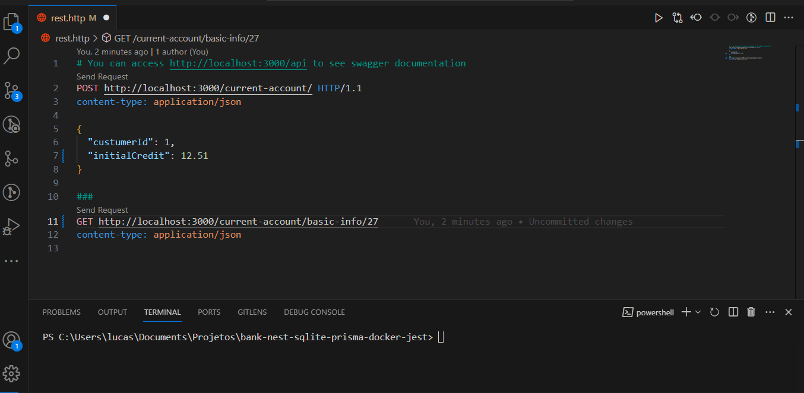
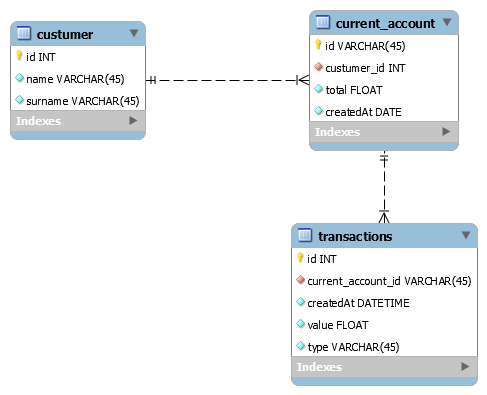
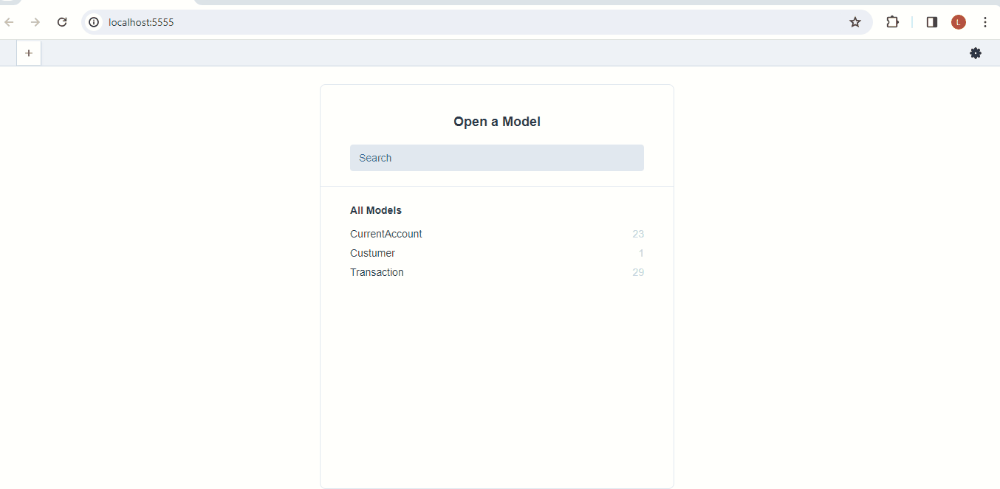

<h1 align="center">
     🐙 <a href="#" alt=""> Node.js Test Bank</a>
</h1>

<h3 align="center">
    🧪 Backend Test. 💚
</h3>

<h4 align="center">
	🚧   Finished 🚀 🚧
</h4>

### Prerequisites

Before you need install follow tools in your machine:
[Git](https://git-scm.com), [Node.js](https://nodejs.org/en/), [Docker](https://www.docker.com/resources/what-container).
Beyond is good to has an editor for to work with the code like [VSCode](https://code.visualstudio.com/)

# Summary

- [1. Overview](#1-overview)
  - [1.1 Stack](#11-stack)
  - [1.2. Auxiliary libs](#12-auxiliary-libs)
- [2. How To Run](#2-🔬-how-to-run)
  - [2.1 Containers](#21-containers)
  - [2.2 Local](#22-local)
  - [2.3 Evaluating Signin and Private Route](#23-evaluating)
  - [2.4 API Endpoints](#24-endpoints)
- [3. Prisma Local Database](#3-prisma-database)
- [4. How to create a new branch](#4-new-branch)
  - [4.1 Commits](#41-commits)
- [5. Software Architecture](#5-software-architecture)
- [6. Recommended Extensions](#6-recommended-extensions)

# 1. Overview

Bank is an API to open a new &quot;current account&quot; of already existing customers

Result:



Diagram:

see diagram entity relationship for documentation




## 1.1. Stack

- [Typescript](https://www.typescriptlang.org/.docs/handbook/typescript-in-5-minutes.html)
- [Node](https://nodejs.org/en/about/)
- [NestJs](https://docs.nestjs.com/)
- [Sqlite](https://www.sqlite.org/index.html)
- [Prisma](https://www.prisma.io/)
- [GitHub](https://github.com/)
- [Jest](https://jestjs.io/)
- [Docker](https://www.docker.com/resources/what-container)

## 1.2. Auxiliary libs

- [Joi](https://joi.dev)
- [Prisma](https://www.prisma.io/)
- [Swagger](https://swagger.io/)

# 2. 🔬 How To Run

```bash

# Clone this repository
$ git clone https://github.com/LucasJunio/bank

# Acces the project folder in your terminal/cmd
$ cd bank

# Copy base.env to .env
$ cp base.env .env

```

## 2.1. Containers

```bash

# Build the image docker
$ docker build -t bank .

# Run tests
$ docker run -e CI=true bank npm run test

# Build the container docker
$ docker run -p 3000:3000 bank

# Access SWAGGER documentation in:
http://localhost:3000/api

# The aplication going to open in  port:3000 - access http://localhost:3000

```

## 2.2. Local

Run the development server local with &quot;yarn&quot;, &quot;npm&quot;, &quot;pnpm&quot; or manager package your preference:

```bash

# Create .env file
$ cp base.env .env

# Install dependencies
$ yarn install

# Generate the TypeScript code associated with your database models
$ npx prisma generate

# Building migrations
$ npx prisma migrate dev

# Building mock data
$ npx prisma db seed

# Run the project
$ yarn start

```

The aplication going to open in port:3000 - access [http://localhost:3000](http://localhost:3000)

### 2.3 Evaluating Create New Account and Basic Info about new account


You can login by sending a POST request to the `/api/v1/login` endpoint. Here's an example using cURL:

```bash

curl -X POST \
  -H "Content-Type: application/json" \
  -d '{
  {
  "custumerId": 1,
  "initialCredit": 25.51
  }
}' \
http://localhost:3000/current-account/

```
The response will be status code 201 created and informations about the new account.

You can evaluate the basic info route by sending a GET request to the `http://localhost:3000/current-account/basic-info/:id` endpoint. Here's an example using cURL:

```bash
curl -X GET
  -H "Content-Type: application/json" \
http://localhost:3000/current-account/basic-info/:id
```

The response will be status code 200 success and informations about the account {:id}.

### 2.4 API Endpoints

- `POST http://localhost:3000/current-account/`:
- `GET  http://localhost:3000/current-account/basic-info/1`:

# 3. Prisma Local Database

You can see the local database Prisma Studio is up on http://localhost:5555.

```bash

# Running local database
$ npx prisma studio

```

Result:



# 4. How to create a new branch

Ever that's necessary to create a new branch feature, create by [main]branch, implement your development, merge this feature/branch to develop, when all it's ok, give a merge of this feature/branch to main[branch].

Let's go to follow the git flow patterns to create a new branch, to more info browse in link below to learn more how to implement in simple way.

Workflow gitflow: https://www.atlassian.com/br/git/tutorials/comparing-workflows/gitflow-workflow

```bash

# Example creating a new branch
$ git checkout -b feature/TASK-1

```

## 4.1. Commits

For commit your changes, you can follow the suggestion to use conventional commits [https://www.conventionalcommits.org/en/v1.0.0/] for to improve your commit descriptions and help the understand of the team. Exist a extension in vscode that can help you with this mission.

vscode extension id in .vscode/extensions.json:

"recommendations": ["vivaxy.vscode-conventional-commits"]

# 5. Software Architecture

Main folder tree.

C:.

- src
- ├───core
- └───module
-       ├───controller
-       ├───input
-       ├───repository
-       ├───schema
-       ├───service
-       └───validators

# 6. Recommended Extensions

You can check out a list of recommended extensions in the file `.vscode/extensions.json`, or by opening the "Extensions" Tab in the "Recommended" pane.

---

## 🦸 Author

<a href="https://madaztec.com/">
 
 <br />
 <sub><b>Lucas Junio</b></sub></a> <a href="https://madaztec.com/" title="Madaztec">🚀</a>
 <br />

---

## 📝 Licence

Made with ❤️ by Lucas Junio 👋🏽 [Contact](https://www.linkedin.com/in/lucas-junio/)
